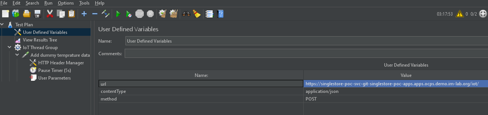
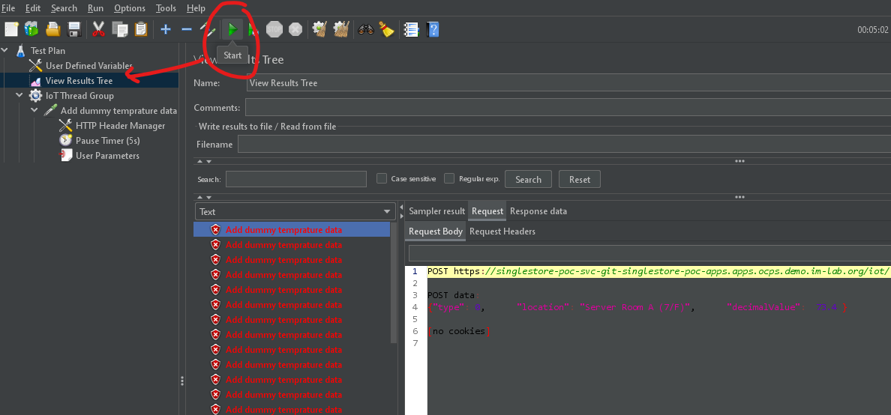

# Testing with HTTP request

IOT records can be inserted via HTTP request after starting the application. HTTP client such as [Postman](https://www.postman.com/downloads/) can be used.  

## Basic APIs
- Health check: (GET) https://< Hostname >/iot/ 
- Insert iot data: (POST) https://< Hostname >/iot/  
Request body:
```json
{
    "type": 0,      
    "location": "Server Room B (15/F)",      
    "decimalValue": 72.4 
}
```
   
# Generate continuous data with JMeter

For DB testes / fail over testes it may be desirable to auto insert data continuously. This can be done by [JMeter](https://jmeter.apache.org/download_jmeter.cgi). 

1. Open the [prepared script](src/main/resources/jmeter/dummy_iot_data.jmx) with JMeter and modify `User Defined Variables` -> `url` :
   
2. Click start button and request results should be gradually populated at `View Results Tree`:

3. Data should be found at database if inserted successfully. 